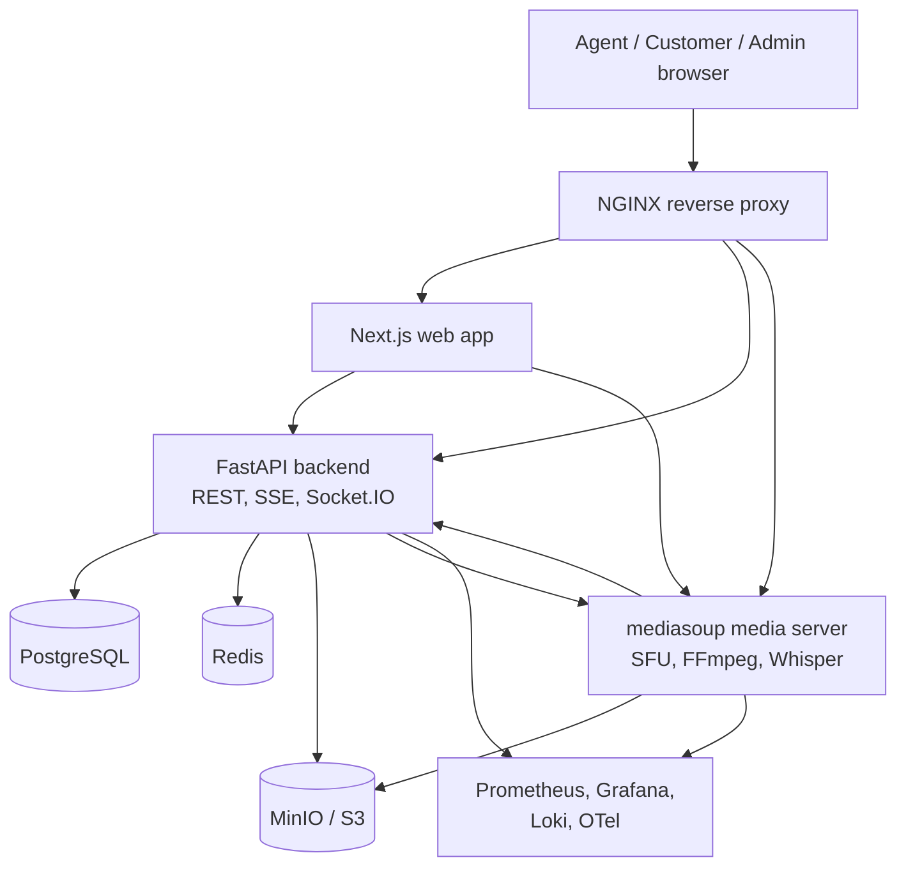

# Atom Support Vision

Self-hosted, AI-assisted real-time video customer support for teams that need
visual context without sending calls through a hosted video SDK.

Atom Support Vision lets an agent create a support session, invite a customer by
link, talk over server-routed audio/video, chat, share files, record the call,
stream live transcription, and review AI-generated notes after the session.

## What This Project Demonstrates

- Browser-based agent and customer video calls with no customer install.
- Server-routed media using a self-hosted mediasoup SFU.
- Agent/customer/admin roles with backend-enforced RBAC.
- Session lifecycle, single-use invites, presence, reconnect handling, and history.
- In-call chat, file sharing, screen sharing, annotations, and recording.
- Live faster-whisper transcription and AI session intelligence.
- Runtime-editable feature flags and knowledge-base entries.
- Observability with Prometheus, Grafana, Loki, Promtail, and OpenTelemetry.
- Docker Compose for local deployment and Kubernetes manifests for cluster deployment.

## Architecture At A Glance



Detailed architecture diagrams are in [docs/ARCHITECTURE.md](docs/ARCHITECTURE.md).

## Tech Stack

| Layer | Technology |
|---|---|
| Web | Next.js 15, React 19, TypeScript, Tailwind CSS, Zustand, React Query |
| Backend | FastAPI, SQLAlchemy 2, Alembic, Socket.IO, Server-Sent Events |
| Media | Node.js, mediasoup, FFmpeg, faster-whisper |
| Data | PostgreSQL, Redis, MinIO / S3 |
| Observability | Prometheus, Grafana, Loki, Promtail, OpenTelemetry |
| Deployment | Docker Compose, Kubernetes kustomize manifests |

## Repository Layout

```text
.
+-- apps
|   +-- backend        # FastAPI API, SQLAlchemy models, Alembic, tests
|   +-- media          # mediasoup SFU, recorder, transcriber
|   +-- web            # Next.js app
+-- packages
|   +-- shared         # shared TypeScript DTOs, enums, signaling contracts
+-- infra              # NGINX, Prometheus, Grafana, Loki, OTel config
+-- k8s                # Kubernetes base and dev/prod overlays
+-- docs               # API, architecture, deployment, schema
+-- tests              # Playwright e2e and k6 load tests
+-- docker-compose.yml
+-- .env.example
```

## Local Docker Setup

Start Docker Desktop first on Windows. Wait until the Docker engine is running.

```powershell
cd D:\atomquest

# First run only, if .env does not already exist:
Copy-Item .env.example .env

# Build and start the whole platform:
docker compose up -d --build

# Check containers:
docker compose ps
```

Main URLs:

| Service | URL |
|---|---|
| App through NGINX | http://localhost |
| Web direct | http://localhost:3000 |
| Backend API docs | http://localhost:4000/api/docs |
| Backend health | http://localhost:4000/health |
| Media health | http://localhost:5000/health |
| Grafana | http://localhost:3001 |
| Prometheus | http://localhost:9090 |
| MinIO console | http://localhost:9001 |

The backend container runs Alembic migrations at startup and seeds demo data
idempotently on boot. If you ever need to run it manually:

```powershell
docker compose exec backend sh -c "alembic upgrade head && python -m app.db.seed"
```

## Demo Accounts

| Role | Email | Password |
|---|---|---|
| Agent | `agent@atomvision.dev` | `Agent@123` |
| Admin | `admin@atomvision.dev` | `Admin@123` |

Customers do not need accounts. They join with an invite link generated by an agent.

## Demo Flow

1. Open `http://localhost`.
2. Sign in as the agent.
3. Create a new session.
4. Copy the invite link from the room.
5. Open the invite in an incognito/private browser window.
6. Join as a customer.
7. Try mute, camera toggle, screen share, annotation, chat, file upload, and recording.
8. End the session as the agent.
9. Open history to review events, chat, transcript, recording status, and AI notes.
10. Sign in as admin to view live sessions, analytics, audit logs, and runtime config.

## Docker Operations

```powershell
# Start existing containers
docker compose up -d

# Rebuild after code changes
docker compose up -d --build

# Restart all services
docker compose restart

# Restart specific services
docker compose restart backend media web nginx

# Follow all logs
docker compose logs -f

# Follow one service
docker compose logs -f backend

# Stop the stack
docker compose down
```

Service names:

```text
postgres redis minio backend media web nginx prometheus grafana otel-collector loki promtail
```

## Development Without Docker

Docker Compose is the recommended path because the media server needs FFmpeg,
Python, faster-whisper, and native mediasoup dependencies. For local development
without Docker, start the infrastructure containers first:

```powershell
docker compose up -d postgres redis minio
```

Then run the app processes:

```powershell
# Backend
cd apps/backend
python -m venv .venv
.\.venv\Scripts\Activate.ps1
pip install -r requirements.txt
alembic upgrade head
python -m app.db.seed
uvicorn app.main:app --reload --host 0.0.0.0 --port 4000
```

```powershell
# Web and media, from repo root
npm install
npm run dev:web
npm run dev:media
```

There is also a Windows helper:

```powershell
powershell -ExecutionPolicy Bypass -File restart.ps1
```

## Environment

Configuration starts from [.env.example](.env.example). Important values:

| Variable | Purpose |
|---|---|
| `DATABASE_URL` | Backend PostgreSQL connection string |
| `REDIS_URL` | Backend Redis connection string |
| `S3_ENDPOINT` | MinIO/S3 endpoint used by backend and media |
| `S3_PUBLIC_ENDPOINT` | Browser-visible S3/MinIO endpoint for signed downloads |
| `JWT_ACCESS_SECRET` | Access-token signing secret |
| `JWT_REFRESH_SECRET` | Refresh-token signing secret |
| `INVITE_TOKEN_SECRET` | Invite-token HMAC secret |
| `MEDIA_ANNOUNCED_IP` | IP advertised in WebRTC ICE candidates |
| `MEDIASOUP_MIN_PORT` / `MEDIASOUP_MAX_PORT` | RTC port range |
| `ANTHROPIC_API_KEY` | Optional AI provider key; local fallback is used if empty |

For production, replace every development secret and set `MEDIA_ANNOUNCED_IP` to
the public IP or reachable host for the media node.

## API And Realtime Interfaces

- REST API base: `http://localhost:4000/api`
- Swagger UI: `http://localhost:4000/api/docs`
- Backend realtime Socket.IO path: `/socket.io`, namespace `/rt`
- Media signaling Socket.IO path: `/socket.io`, namespace `/sfu`
- SSE streams: `/api/stream/{topic}`
- Metrics: `/metrics` on backend and media

Full API details are in [docs/API.md](docs/API.md).

## Testing

```powershell
# Backend unit tests
cd apps/backend
pytest -q
```

```powershell
# Media tests
npm -w @atom/media run test
```

```powershell
# End-to-end tests, stack must be running
npm run test:e2e
```

```powershell
# Load test, requires k6
k6 run -e BASE_URL=http://localhost:4000 tests/load/api-load.js
```

## Kubernetes

```bash
kubectl apply -k k8s/overlays/dev
```

Production manifests are in `k8s/overlays/prod`. The media service is designed
for host networking or equivalent UDP/TCP exposure so WebRTC candidates remain
reachable.

## Operational Notes

- `getUserMedia` works on `localhost`; production domains need HTTPS.
- On Docker Desktop, the RTC range is published as explicit TCP/UDP ports.
- For higher concurrency on Linux, run the media service with host networking or
Kubernetes host networking.
- Whisper defaults to CPU `int8` with `base.en`; use `tiny.en` for lower latency
or CUDA settings on GPU nodes.
- Recording and transcription are designed for the one-to-one support-call use case.

## License

MIT. Built for AtomQuest Hackathon 1.0 Finale.
