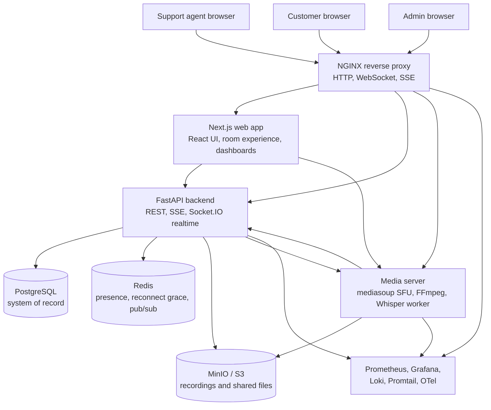
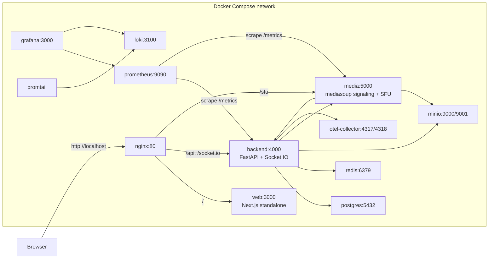
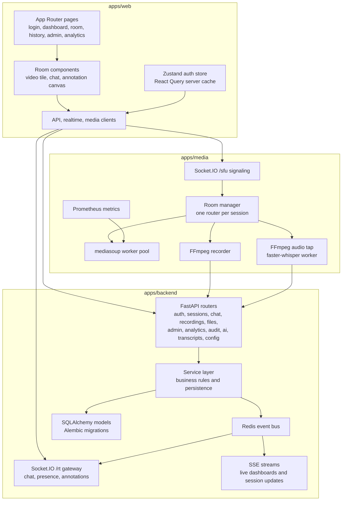
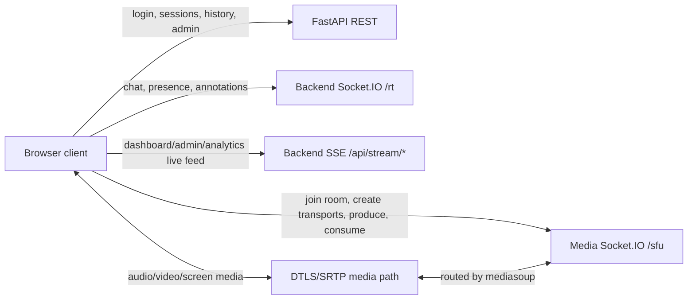
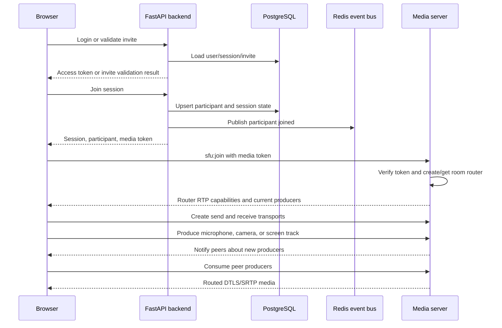
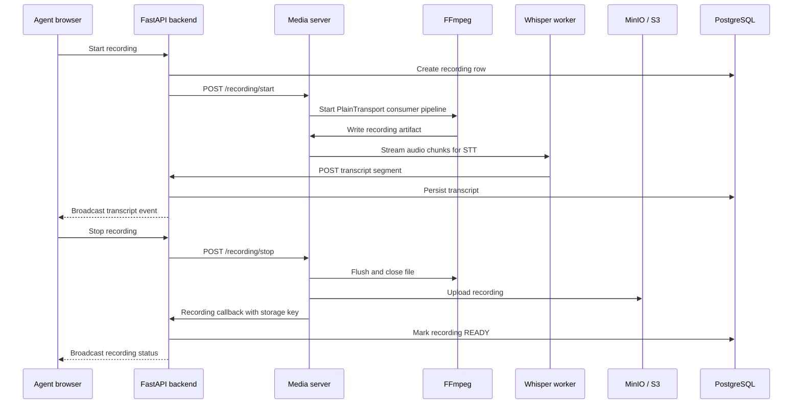
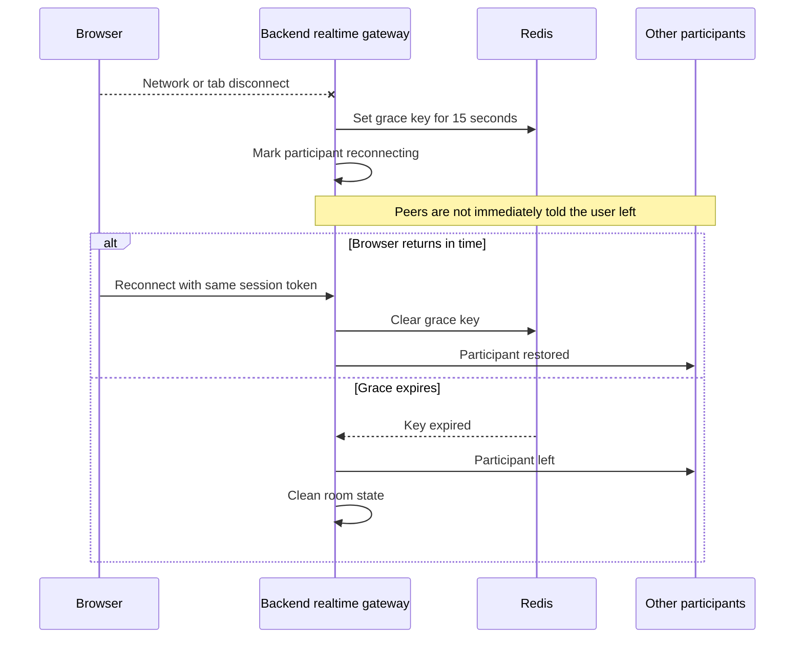
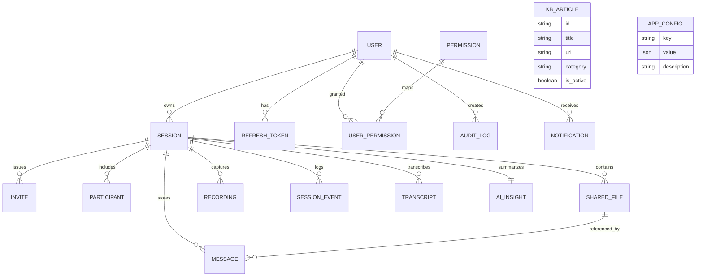
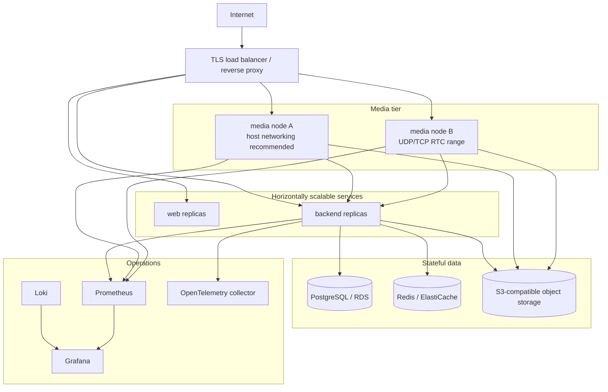

# Atom Support Vision Architecture

Atom Support Vision is a self-hosted, AI-assisted video support platform. The core
architectural constraint is that audio and video must be routed through infrastructure
we own. Browser clients never use a hosted video SDK and never rely on raw peer-to-peer
media as the product path.

## System Context



## Container Topology



## Application Components



## Request And Realtime Paths



## Session Join And Media Flow



## Recording And Transcription Flow



## Reconnect Grace Window



## Data Model



## Deployment View



## Key Design Decisions

| Area | Decision | Reason |
|---|---|---|
| Video architecture | mediasoup SFU, one router per session | Keeps media server-routed and avoids hosted video APIs. |
| Backend framework | FastAPI with async SQLAlchemy | Good fit for REST, SSE, background IO, and Python AI integrations. |
| Realtime control | Socket.IO plus SSE | Socket.IO handles room interactions; SSE powers live dashboards cleanly. |
| State sharing | Redis pub/sub and transient keys | Supports reconnect grace windows and multi-replica realtime fanout. |
| Storage | PostgreSQL for records, MinIO/S3 for binary artifacts | Keeps queryable metadata separate from large files and recordings. |
| Recording | SFU PlainTransport to FFmpeg | Server-side recording remains under our control. |
| Transcription | FFmpeg audio tap to faster-whisper | Self-hosted STT with no transcription SaaS dependency. |
| Operations | Prometheus, Grafana, Loki, OTel | Standard observability stack for metrics, logs, and traces. |

## Service Responsibilities

| Service | Owns |
|---|---|
| `web` | Browser UI, room page, admin screens, analytics views, client API/realtime/media adapters. |
| `backend` | Auth, RBAC, sessions, invites, chat persistence, files, recordings metadata, AI summaries, admin, analytics, audit, SSE, Socket.IO `/rt`. |
| `media` | mediasoup workers, SFU room state, WebRTC transports, producers/consumers, recording pipeline, transcription pipeline. |
| `postgres` | Durable relational state. |
| `redis` | Presence, reconnect grace keys, pub/sub event bus. |
| `minio` | S3-compatible object storage for recordings and uploaded files. |
| `nginx` | Reverse proxy for web, API, backend WebSocket, and media signaling. |
| `prometheus` | Metrics scraping for backend and media. |
| `grafana` | Dashboards for metrics and logs. |
| `loki` / `promtail` | Container log collection. |
| `otel-collector` | Trace and OTLP metrics collection. |

## Security Model

- JWT access tokens and rotating HTTP-only refresh cookies protect authenticated app routes.
- Customer joins use HMAC-signed invite tokens; only token hashes are stored.
- Role and permission checks are enforced in backend dependencies, not only in the UI.
- Agent-only operations include session creation, invite creation, ending sessions, and recording controls.
- Admin operations include live monitoring, force-end, user review, audit logs, and runtime config changes.
- Uploaded files are size-limited, MIME-sniffed, stored outside the database, and downloaded through signed URLs.
- Browser media is encrypted with WebRTC DTLS/SRTP while still being routed by the self-hosted SFU.

## Runtime Configuration

Runtime configuration and knowledge-base content are stored in the database:

- `app_config` stores feature flags and tunables.
- `kb_articles` stores support knowledge used by the AI assistant.
- Changes are broadcast through Redis and SSE so dashboards and rooms update without redeploying.

## Local Docker Stack

```powershell
cd D:\atomquest
Copy-Item .env.example .env
docker compose up -d --build
docker compose ps
```

Main URLs:

- App through NGINX: `http://localhost`
- Web direct: `http://localhost:3000`
- API docs: `http://localhost:4000/api/docs`
- Media health: `http://localhost:5000/health`
- Grafana: `http://localhost:3001`
- Prometheus: `http://localhost:9090`
- MinIO console: `http://localhost:9001`
